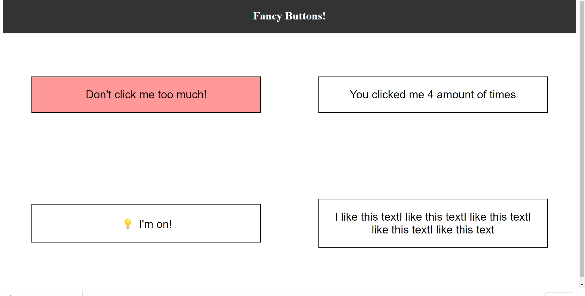
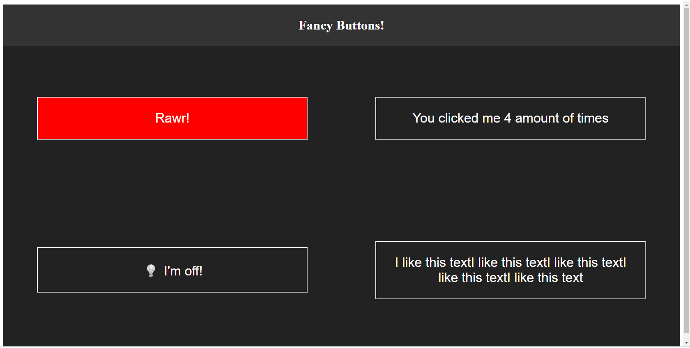

# The Fancy Buttons
___
This project is a part of [Lighthouse labs.](https://www.lighthouselabs.ca/) educational program and was created only in educational purposes.

*The Fancy Buttons* is about creating buttons that will change their state when we interact with them!

## The Goal
The main goals of this project are:

* using a state inside components
* passing down ```props``` to child components
* manage a state from a main component that trickles down to child components
___
For this project, we will create four buttons. Each button will have a specific behavior:

* The **counter button** will keep track how many times we click on it.
* The **angry button** will change colour to get more red until it reaches a maximum threshold.
* The **light switch button** will turn on and off when clicked.
* The **text repeater button** will copy the text of the button over and over.
___

### Project view
Light mode


Dark mode

___

This project was bootstrapped with [Create React App](https://github.com/facebook/create-react-app).

## Available Scripts

 to lunch:

#### `npm start`

Runs the app in the development mode.\
Open [http://localhost:3000](http://localhost:3000) to view it in your browser.

The page will reload when you make changes.\
You may also see any lint errors in the console.


